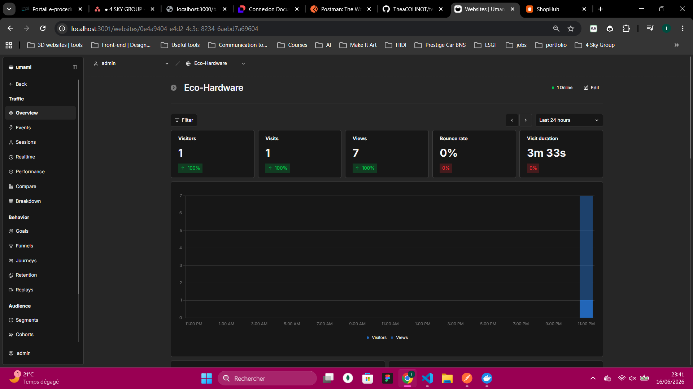
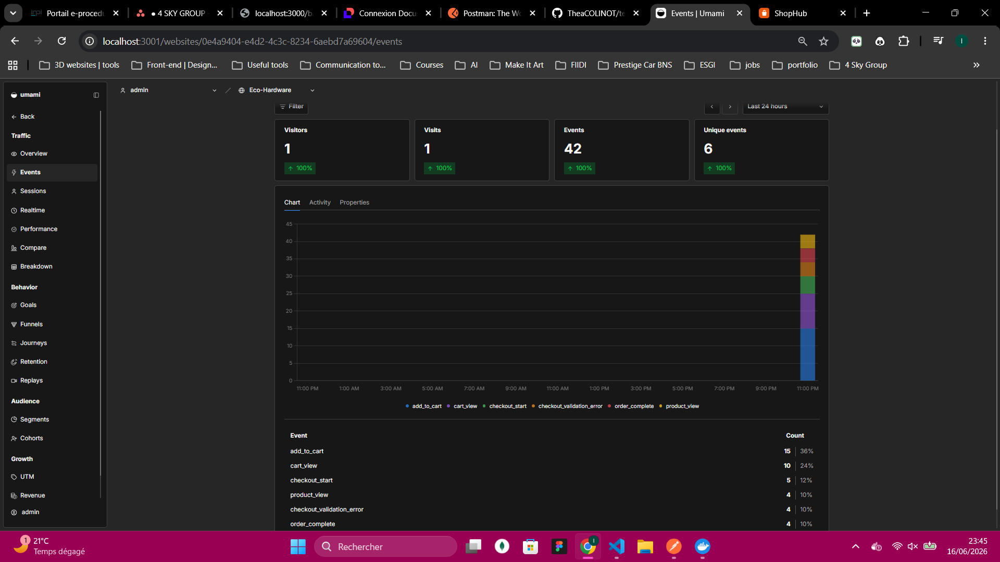
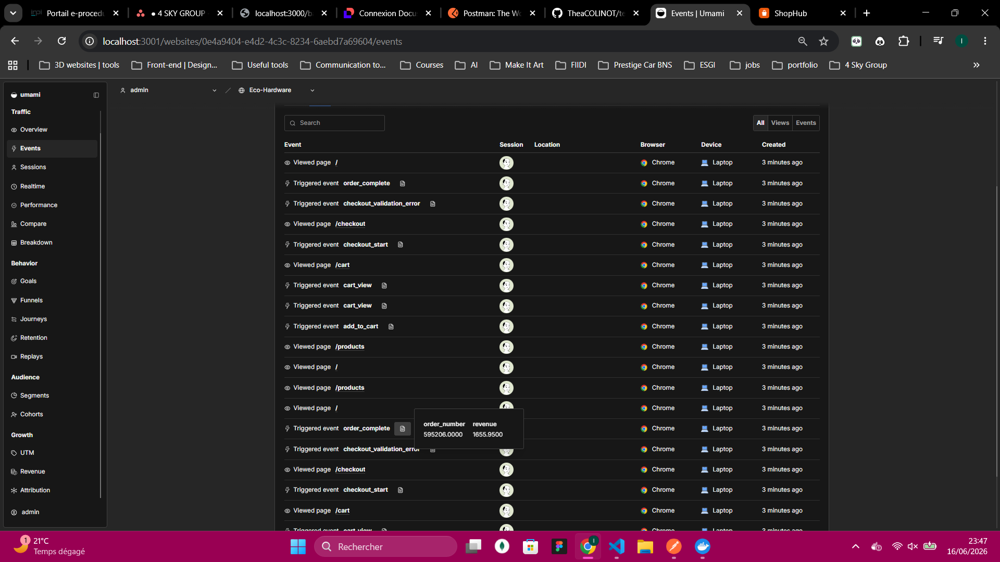

# Umami – Suivi analytique ECO HARDWARE

> Mise en place et résultats du tracking comportemental via Umami (self-hosted)

---

## Contexte

L'idée c'était de savoir concrétement ce que font les utilisateurs sur le site : quels produits ils regardent, est-ce qu'ils vont jusqu'au bout du tunnel d'achat, où ils abandonnent. Pour ça on a utilisé Umami, un outil open-source qu'on héberge nous mêmes sur notre propre infra Docker, connecté à sa propre base de données PostgreSQL.

**Pour lancer tous les services (UMAMI + GLITCHTIP) :**
```bash
docker compose up -d
```

Umami tourne sur `http://localhost:3001` et le script de tracking est injecté directement dans le `index.html`

---

## Ce qu'on track

On a instrumenté les événements suivants dans `src/lib/analytics.js` :

| Événement | Quand il se déclenche |
|---|---|
| `product_view` | ouvre la fiche d'un produit |
| `add_to_cart` | ajoute un produit au panier |
| `cart_view` | consulte son panier |
| `checkout_start` | commence la page de paiement |
| `order_complete` | La commande est validée |
| `category_filter` | filtre par catégorie |
| `checkout_validation_error` |a une erreur dans le formulaire de commande |
| `utm_visit` | arrive depuis un lien avec paramètres UTM |

Chaque évenement embarque aussi automatiquement les paramètres UTM si il y en a (via `sessionStorage`), ce qui permet de filtrer par source directement dans le dashboard Umami.

---

## Dashboard générale

Ci-dessous le dashboard principal après avoir simulé plusieurs parcours utilisateurs. On voit les pages vues, visiteurs uniques, et les événements custom qui remontent bien.

&nbsp;



&nbsp;


&nbsp;

---

## Tunnel d'achat

Le tunnel qu'on a simulé c'est le suivant :

```
Accueil → Liste produits → Fiche produit → Ajout panier → Checkout → Commande validée
```

On a fait une dizaine de parcours complets et quelques parcours incomplets (abandon panier, erreur formulaire...) pour avoir des données un minimum représentatives.

&nbsp;

**[ Événements custom dans Umami – tunnel d'achat ]**


&nbsp;

**[ Détail de l'événement `order_complete` avec ses propriétés ]**


&nbsp;

Ce qui est pratique avec Umami c'est qu'en cliquant sur un event on voit toutes ses propriétés – pour `order_complete` on a le `order_number` et le `revenue`, pour `add_to_cart` on a le `product_name`, la `category`, le `price` etc. Donc on peut vraiment analyser les comportements en détail.

---

## Analyse du taux de rebond et de conversion

### Parcours simulés

On a fait une quinzaine de sessions de test réparties comme ça :

- **5 parcours complets** : accueil → produit → panier → commande validée
- **4 abandons panier** : l'utilisateur ajoute un produit mais quitte avant le checkout
- **3 rebonds** : arrive sur la home et repart direct
- **2 erreurs formulaire** : le checkout déclenche un `checkout_validation_error`
- **1 parcours filtrage** : navigation par catégorie uniquement, sans achat


## Limites du projet

Ce qui manque encore pour une observabilité vraiment complète c'est des alertes automatiques (style "le taux de conversion a chuté de 50% ce soir"). Umami seul ne fait pas ça, faudrait coupler ça avec un système d'alerte externe.

---

## Conclusion

L'intégration Umami fonctionne. On peut maintenant :

- Voir en temps réel ce que font les utilisateurs sur le site
- Suivre le tunnel d'achat étape par étape
- Identifier les points de friction (erreurs formulaire, abandons panier)
- Filtrer tous les events par source UTM pour croiser avec les campagnes marketing

---

*Rapport rédigé dans le cadre du projet ECO HARDWARE – Juin 2026*
