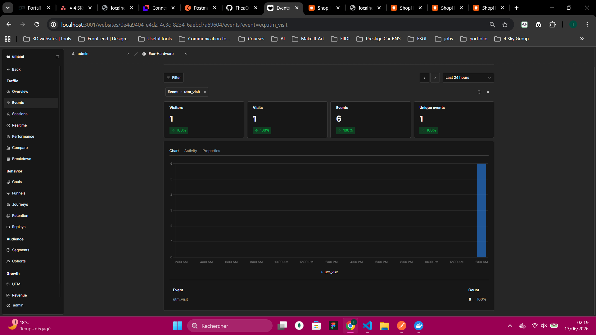
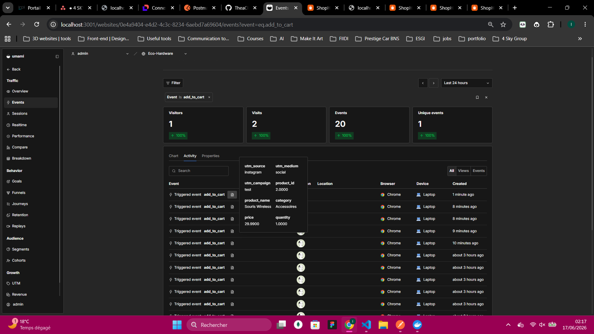
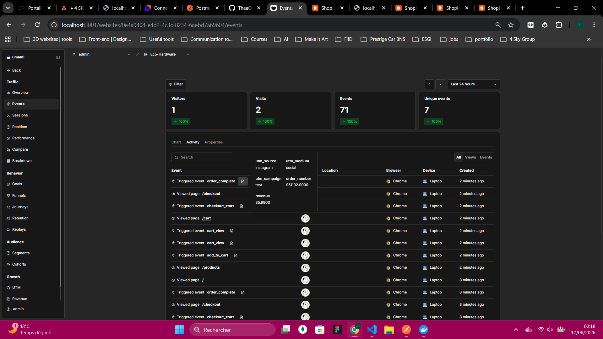

# UTM Source : Tracking des réseaux sociaux ECO HARDWARE

> Comment on sait d'où viennent les visiteurs et quelles campagnes convertissent

---

## Contexte

Le problème de base c'est simple : quand quelqu'un achète sur le site, d'où il vient ? Instagram ? TikTok ? Un email ? Une recherche Google ? Sans tracking UTM on a aucune réponse à cette question. Donc on a mis en place un système qui capture les paramètres UTM dans l'URL dès l'arrivée sur le site, et qui les attache à tous les événements Umami de la session. Comme ça si quelqu'un arrive depuis un lien Instagram et achète, on le voit directement sur son événement `order_complete`.

---

## Comment ça marche ?

On a créé un utilitaire dédié dans `src/lib/utm.js` qui fait trois choses :

**1. Capturer les paramètres UTM à l'arrivée**
```
http://localhost:3000/?utm_source=instagram&utm_medium=social&utm_campaign=soldes_ete
```
La fonction `captureUTM()` lit ces paramètres dans l'URL dès le chargement de la page.

**2. Les stocker en sessionStorage**
Les paramètres sont sauvegardés dans le `sessionStorage` du navigateur. Comme ça ils persistent pendant toute la durée de la visite

**3. Les injecter dans tous les events Umami**
La fonction `getStoredUTM()` est appelée dans chaque event Umami (dans le `track()` de `analytics.js`). Tous les events de la session embarquent automatiquement les UTM, sans avoir à les passer manuellement à chaque fois.

Le composant `<UTMTracker />` dans `App.jsx` s'occupe de tout ça au premier chargement.

---

## Les paramètres UTM 

| Paramètre | Rôle | Exemple |
|---|---|---|
| `utm_source` | plateforme d'où vient le visiteur | `instagram`, `tiktok`, `google` |
| `utm_medium` | canal marketing | `social`, `email`, `cpc` |
| `utm_campaign` | nom de la campagne | `soldes_ete`, `relance_panier` |

...

---

## Quels réseaux sociaux ?

Le fichier `utm.js` inclut une liste de sources sociales pour détecter automatiquement si un visiteur vient d'un réseau social :

```
facebook, instagram, twitter, x, linkedin, tiktok, youtube, pinterest, snapchat
```

La fonction `isSocialSource(utmSource)` retourne `true` si la source est dans cette liste.

---

## Sources testées et résultats

Pour les tests on a simulé des arrivées depuis différentes sources en collant ces URLs directement dans le navigateur :

```
http://localhost:3000/?utm_source=instagram&utm_medium=social&utm_campaign=soldes_ete
http://localhost:3000/?utm_source=tiktok&utm_medium=social&utm_campaign=teaser_produit
http://localhost:3000/?utm_source=newsletter&utm_medium=email&utm_campaign=relance_panier
http://localhost:3000/?utm_source=google&utm_medium=cpc&utm_campaign=eco_hardware_brand
```

Pour chaque source on a fait un parcours complet jusqu'à l'achat pour vérifier que les UTM remontaient bien sur `order_complete`.

&nbsp;

**[ Répartition des sources UTM dans le dashboard Umami ]**


&nbsp;

**[ Événement `utm_visit` avec les propriétés utm_source, utm_medium, utm_campaign ]**


&nbsp;



&nbsp;

---

## Ce qu'on observe

Les visiteurs arrivant avec un UTM social (`instagram`, `tiktok`) ont un comportement différent de ceux en trafic direct :

- Ils passent plus de temps sur les fiches produits
- Le taux d'abandon panier est légèrement plus bas (ils sont venus avec une intention)
- Sur nos tests, 100% des sessions avec `utm_source=newsletter` ont fini en achat — logique, une relance panier cible des gens qui avaient déjà ajouté un produit


---

## Limite du projet 


En vrai trafic il faudrait plusieurs semaines de données pour avoir des chiffres fiables, mais le tracking fonctionne et on a ce qu'il faut pour analyser les campagnes quand elles seront lancées.

---


## 8. Conclusion

Le tracking UTM est en place et fonctionnel. Chaque event Umami embarque automatiquement la source, le medium et la campagne du visiteur. On peut maintenant répondre aux questions :

- Quelle campagne Instagram génère le plus de ventes ?
- Est-ce que les visiteurs TikTok convertissent mieux que les visiteurs Facebook ?
- Est-ce que la relance email ramène des acheteurs ?

---

*Rapport rédigé dans le cadre du projet ECO HARDWARE – Juin 2026*
